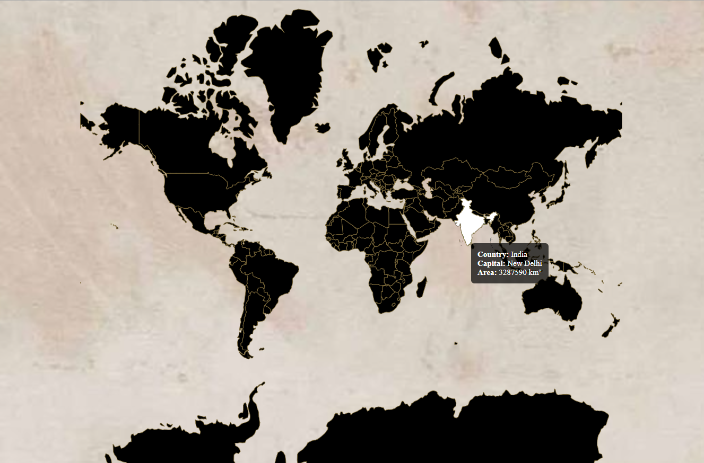

# Interactive World Map Project

This project is an interactive world map built using D3.js. Users can hover over countries to display their names, capitals, and areas.

## Features
- Displays an interactive map of the world.
- Shows country name, capital, and area when hovered.
- Supports customization for design and aesthetics.

## Screenshots


## Setup Instructions
1. Clone the repository:
   ```bash
   git clone https://github.com/Sanjana-Upadhyaya/Interactive-World-Map.git
